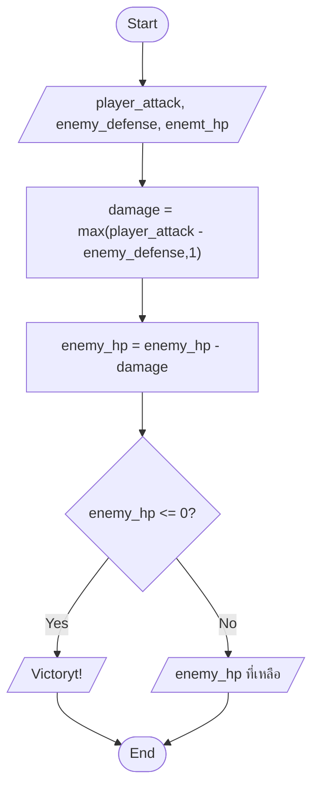
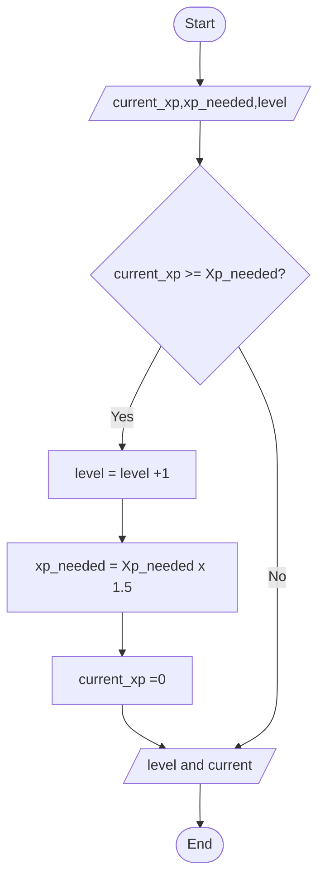
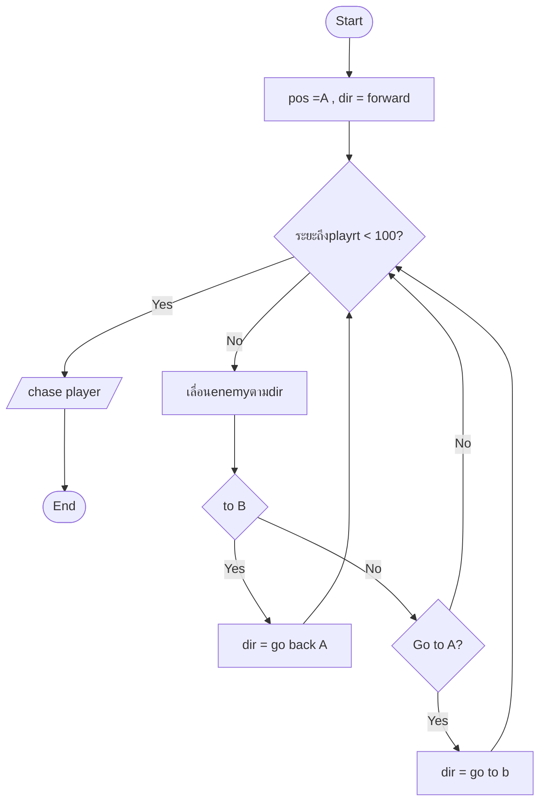

```mermaid
flowchart TD
	Start([Start]) --> Input[/player_attack, enemy_defense, enemt_hp/]
	Input --> Calc["damage = max(player_attack - enemy_defense,1)"]
	Calc --> Reduce["enemy_hp = enemy_hp - damage"]
	Reduce --> D1{enemy_hp <= 0?}
	D1 -->|Yes| Win[/Victoryt!/] 
	D1 -->|No| Show[/enemy_hp ที่เหลือ/]
	Win & Show --> End([End])
```

```mermaid
flowchart TD
	Start([Start]) --> Input[/current_xp,xp_needed,level/]
	Input --> need{current_xp >= Xp_needed?}
	need -->|Yes| level[level = level +1]
	level --> Xp[xp_needed = Xp_needed x 1.5]
 	Xp --> Current[current_xp =0]
	Current --> End[/level and current/]
	need -->|No| End[/level and current/]
	End --> Output([End])
```

```mermaid
flowchart TD
	Start([Start]) --> Input[pos =A , dir = forward]
	Input --> DIR{ระยะถึงplayrt < 100?}
	DIR -->|Yes|Chase[/chase player/] -->End([End])
	DIR -->|No|enemy[เลื่อนenemyตามdir]
	enemy --> B{to B}
	B -->|Yes|dirA[dir = go back A]-->DIR
	B -->|No|A{Go to A?}
	A -->|Yes|dirB[dir = go to b]-->DIR
	A -->|No|DIR
```
